# Pokemon APP 
used : https://pokeapi.co/

## Versions

Instructions on how to use them in your own application are linked below.

| Name | Version |
| ------ | ------ |
| React | 17.0.2 |
| React Native | 0.65.1 |
| Node | 14.15.4 |

# Used Library

 For State Management
| Name | Version |
| ------ | ------ |
| redux | 4.1.0 |
| react-redux | 7.2.4 |
| redux-thunk | 2.3.0 |

## Installation

Requires [Node.js](https://nodejs.org/) v10+ to run.
Install the dependencies and devDependencies and start the server.

## For Android

First one : 
```sh
npm install
```

and then : 
```sh
npm run android
```

## For IOS

First one : 
```sh
npm install
```

and then : 
```sh
cd ios
```

and then : 
```sh
pod install
```
and then : 
```sh
npm run ios
```

## Possible Improvements
> sorting list re-desing,
> about and setting screen 

## Android Phone
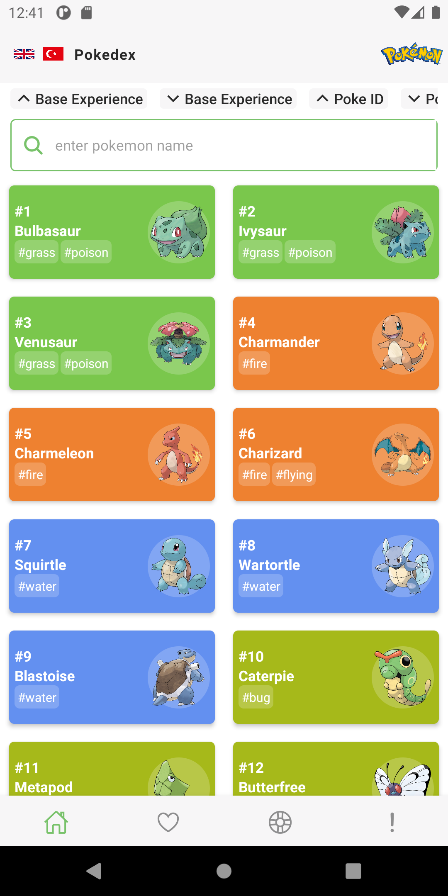
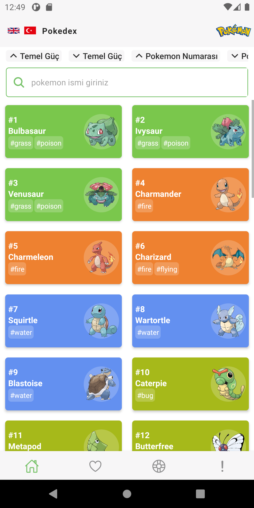
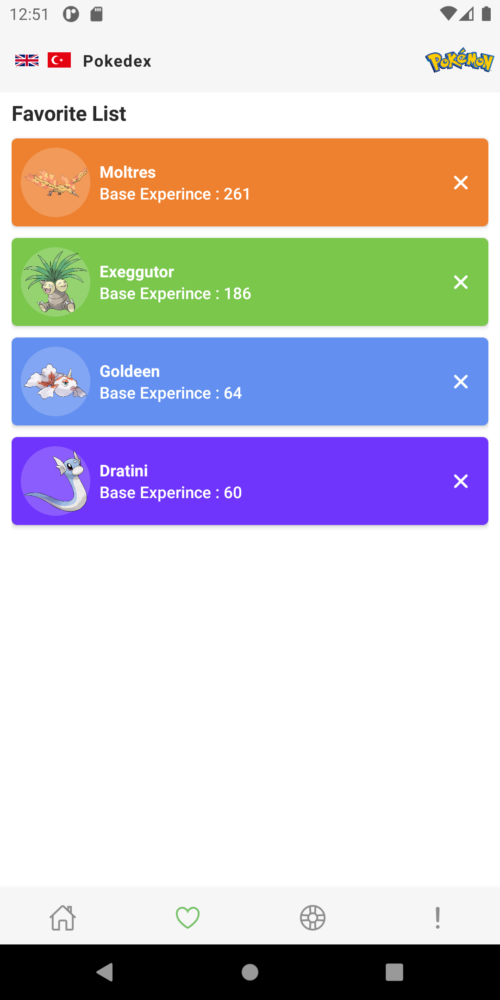
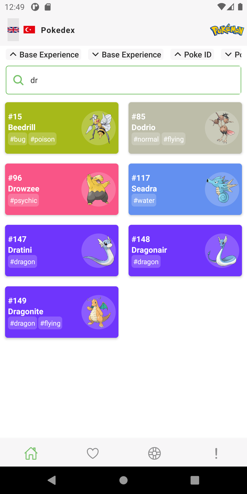
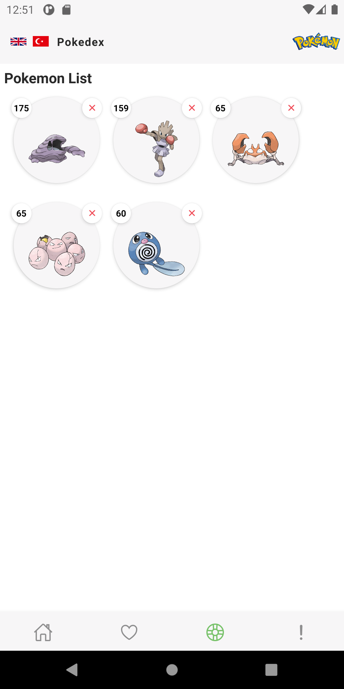
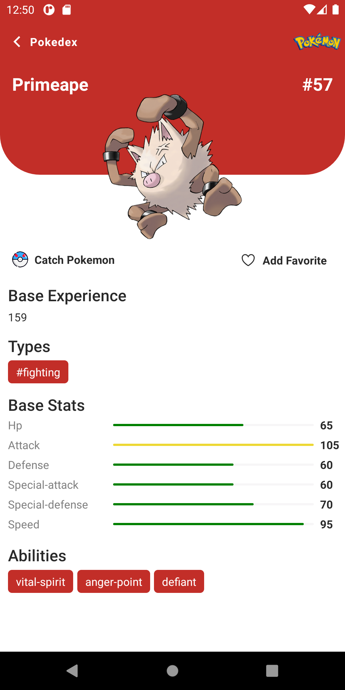
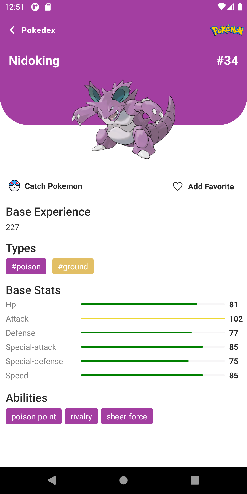

## IOS Phone
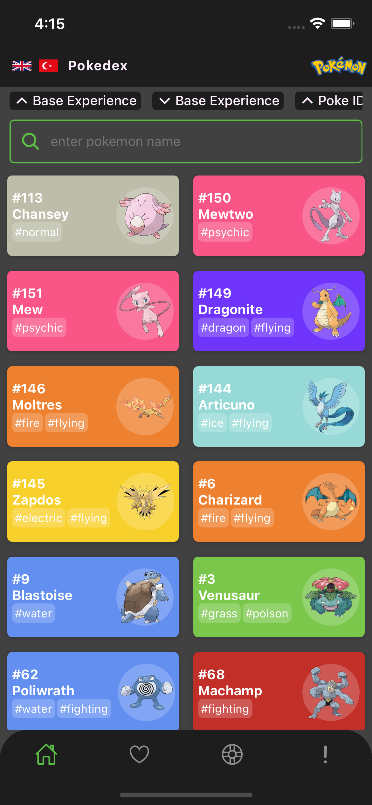
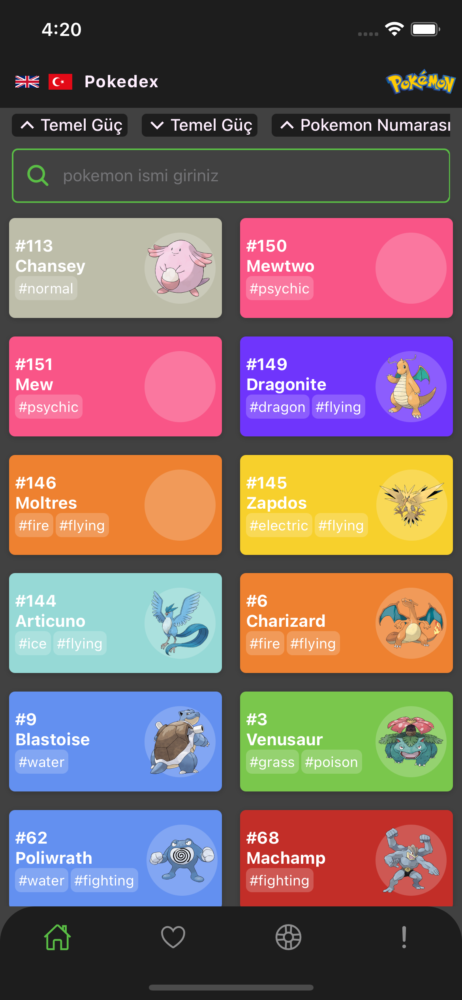
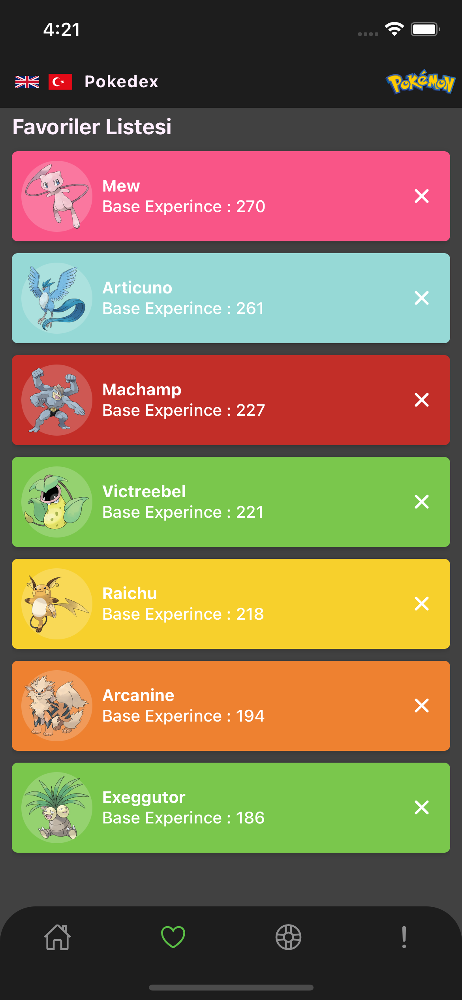
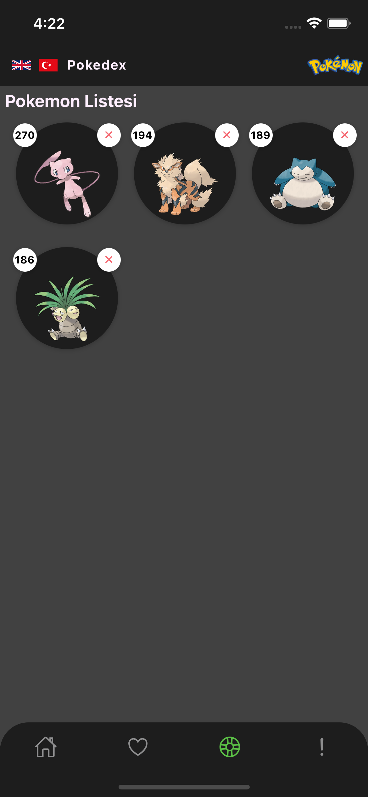
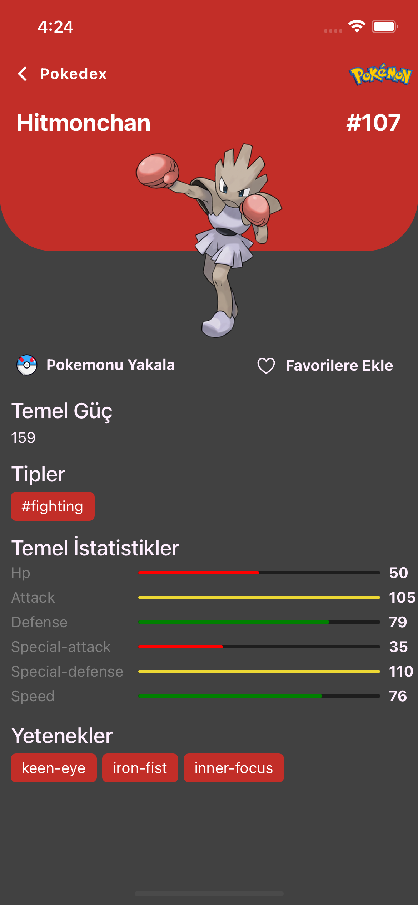
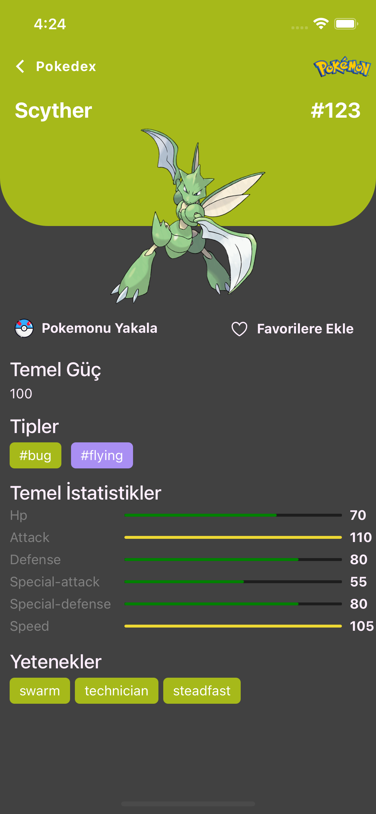
